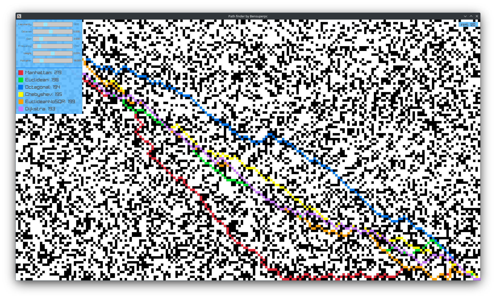

# astar

Fast and easy to use header only 2D astar algorithm library in C++20.

I made it for learning how the astar algorithm works, try to make the fastest, tested and configurable as possible for my needs (future games and works).

# How does it work

It is an [astar algorithm](https://en.wikipedia.org/wiki/A*_search_algorithm), the main idea is to find the shortest path between two points in a grid/map.

# Screenshots



# Features

* [x] Header-only library C++20
* [x] Support 2D map
* [ ] Support 3D map
* [x] Configurable heuristic function and movement cost
* [x] Configurable (diagonal and more) movement
* [x] Debug mode in template argument and lambda function
* [x] Support direct access and not access to the map
* [x] Unit tests and benchmarks

# How to use it

This project is a header-only library and easy to use, just copy the `include/astar` folder in your project and include the `astar/astar.hpp` header or via CMake FetchContent_Declare.

Now you can use the `Astar::Astar` class to find the shortest path between two points in a grid.

```cpp
#include <astar/astar.hpp>
#include <iostream>

auto main() -> int {
    // Create the template class with optional a type (e.g. uint32_t) and a boolean 
    // if you want enable debug mode (AStar::AStar<uint32_t, true>)
    AStar::AStar pathFinder;

    // Define the map size (width, height)
    pathFinder.setWorldSize({10, 10});

    // Set the heuristic function (manhattan, euclidean, octagonal etc...), it is optional, default is euclidean
    pathFinder.setHeuristic(AStar::Heuristic::manhattan);

    // if you want to enable diagonal movement, it is optional, default is false
    pathFinder.setDiagonalMovement(true);

    // Add a obstacle point (5, 5) and (5, 6)
    pathFinder.addObstacle({5, 5});
    pathFinder.addObstacle({5, 6});

    // Find the path from (0, 0) to (9, 9)
    auto path = pathFinder.findPath({0, 0}, {9, 9});

    // Print the path
    for (auto& p : path) {
        std::cout << p.x << " " << p.y << std::endl;
    }

    return 0;
}
```

### Alternative version (direct access to the map)

You can use the alternative version of the library if you want astar have direct access to the map, this version is faster than the non-direct access version.

```cpp
#include <astar/astar.hpp>
#include <iostream>

auto main() -> int {
    // Create the template class with optional a type (e.g. uint32_t) and a boolean
    // if you want enable debug mode (AStar::AStar<uint32_t, true>)
    AStar::AStarFast pathFinder;

    // Set the heuristic function (manhattan, euclidean, octagonal etc...), it is optional, default is euclidean
    pathFinder.setHeuristic(AStar::Heuristic::manhattan);

    // if you want to enable diagonal movement, it is optional, default is false
    pathFinder.setDiagonalMovement(true);

    // Create world 9x9 filled with 0
    std::vector<uint32_t> world(9 * 9, 0);

    // set lambda function to check if is an obstacle (value == 1)
    auto isObstacle = [](uint32_t value) -> bool { return value == 1; };
    pathFinder.setObstacle(isObstacle);

    // Add a obstacle point (5, 5) and (5, 6)
    world[5 + 5 * 9] = 1;
    world[5 + 6 * 9] = 1;

    // Find the path from (0, 0) to (9, 9), it it equal to 0, then the path is not found
    // This version of findPath() is faster due direct access to the world
    auto path = pathFinder.findPath({0, 0}, {9, 9}, world, {9, 9});

    // Print the path
    for (auto& p : path) {
        std::cout << p.x << " " << p.y << std::endl;
    }

    return 0;
}
```

### Debug mode

You can enable the debug mode to call a lambda function when new node is visiting by the algorithm and when new node is added to the open list.

```cpp
#include <iostream>

#include <astar/astar.hpp>

auto main() -> int {
    // Enable debug mode with template argument, this helps avoid performance issues on non-debug classes
    AStar::AStar<uint32_t, true> pathFinder;

    // Set lambda function to debug current node
    std::function<void(const AStar::Node<uint32_t>* node)> debugCurrentNode = [](const AStar::Node<uint32_t>* node) {
        std::cout << "Current node: " << node->pos.x << ", " << node->pos.y << std::endl;
    };
    pathFinder.setDebugCurrentNode(debugCurrentNode);

    // Set lambda function to debug open node
    std::function<void(const AStar::Node<uint32_t>* node)> debugOpenNode = [](const AStar::Node<uint32_t>* node) {
        std::cout << "Add to open list: " << node->pos.x << ", " << node->pos.y << std::endl;
    };
    pathFinder.setDebugOpenNode(debugOpenNode);

    // Define the map size (width, height)
    pathFinder.setWorldSize({10, 10});

    // Set the heuristic function (manhattan, euclidean, octagonal etc...), it is optional, default is euclidean
    pathFinder.setHeuristic(AStar::Heuristic::manhattan);

    // if you want to enable diagonal movement, it is optional, default is false
    pathFinder.setDiagonalMovement(true);

    // Add a obstacle point (5, 5) and (5, 6)
    pathFinder.addObstacle({5, 5});
    pathFinder.addObstacle({5, 6});

    // Find the path from (0, 0) to (9, 9)
    auto path = pathFinder.findPath({0, 0}, {9, 9});

    // Print the path
    for (auto& p : path) {
        std::cout << p.x << " " << p.y << std::endl;
    }

    return 0;
}
```

# Building and installing

See the [BUILDING](BUILDING.md) document.

# Contributing

See the [CONTRIBUTING](CONTRIBUTING.md) document.

# Sources, references and ideas

You can find here the sources, references, libs and ideas that I have used to make this library.

## Astar

Sources and references that I have used to make this library.

* [Wikipedia A* search algorithm](https://en.wikipedia.org/wiki/A*_search_algorithm)
* [A* Pathfinding](https://www.youtube.com/watch?v=-L-WgKMFuhE)
* [AStar](https://github.com/yatima1460/AStar)
* [Introduction to A*](https://theory.stanford.edu/~amitp/GameProgramming/AStarComparison.html)
* [Easy A* (star) Pathfinding](https://medium.com/@nicholas.w.swift/easy-a-star-pathfinding-7e6689c7f7b2)
* [a-star](https://www.ce.unipr.it/people/medici/a-star.html)$
* [A* Search Algorithm](https://yuminlee2.medium.com/a-search-algorithm-42c1a13fcf9f)

## Bench others astar implementations

The list of others astar implementations that I have benchmarked to compare the performance of my implementation.

* [A* Search Algorithm](https://www.geeksforgeeks.org/a-search-algorithm/)
* [a-star](https://github.com/daancode/a-star)
* [A-Star-Search-Algorithm](https://github.com/lychengrex/A-Star-Search-Algorithm)
* [Pathfinding](https://github.com/Gerard097/Pathfinding)

## Libraries

Libraries used in this project.

* [cmake-init](https://github.com/friendlyanon/cmake-init)
* [google test](https://github.com/google/googletest)
* [google benchmark](https://github.com/google/benchmark)
* [Raylib](https://github.com/raysan5/raylib)

# Others

* [Benchmark visualization](https://int-i.github.io/python/2021-11-07/matplotlib-google-benchmark-visualization/)

# Licensing

[LICENSE](LICENSE)
